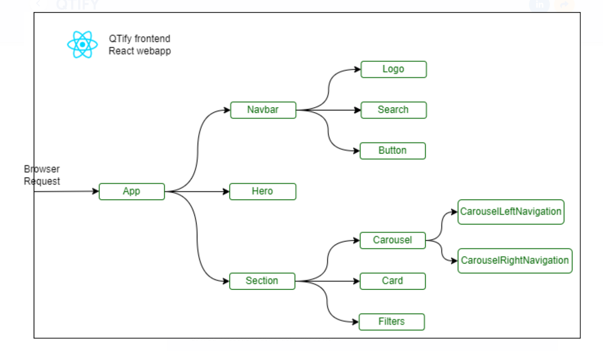
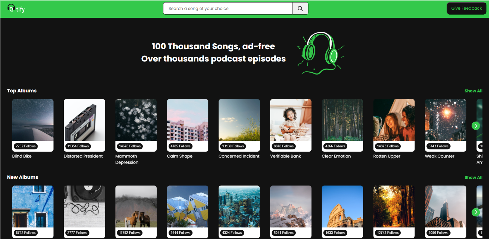
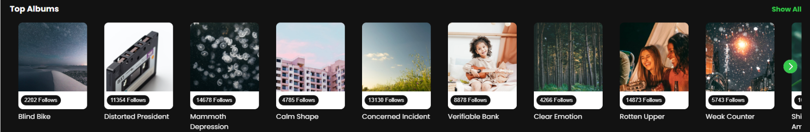
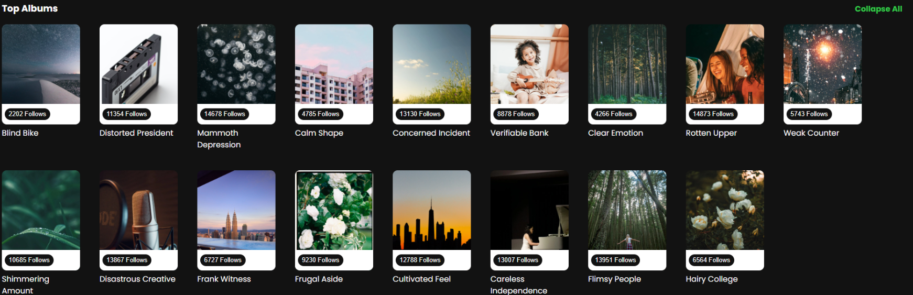
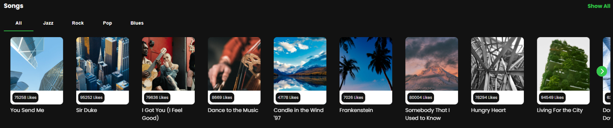
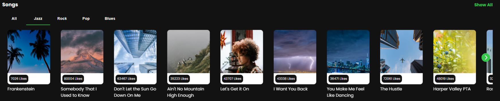

# QTify

QTify is a song-browsing application built from scratch using ReactJS paired with Material UI and Swiper to deliver a seamless and aesthetic user interface, offering songs from different albums and genres for music lovers.

## Project Overview

While building this micro-experience, the developer:

- Conducted a thorough analysis of the provided Figma design, successfully identifying and documenting required front-end components.
- Created modular UI components including Cards, Carousels, and Buttons optimized for reusability across various sections of the application.
- Implemented an intuitive genre-based song filtering system using a customized Material UI Tabs component, allowing users to browse songs by preferred genre.
- Utilized REST APIs to fetch data served by the backend server.
- Deployed the website to Vercel.

## Build QTify - Scope of Work

- Analyzed the Figma design to identify and document necessary front-end components.
- Designed a reusable Button component with unique styling, adaptable for various functionalities across the application.
- Implemented a carousel feature using the Swiper library and enhanced it with custom navigation controls.
- Developed a dynamic Section component capable of rendering content in both carousel and grid layouts using conditional rendering.
- Created a Filters experience with Material UI Tabs for seamless user interaction.
- Integrated Axios for fetching genre options and song data, including error handling.
- Implemented conditional rendering logic to display filter options only within the Songs section.
- Deployed the QTify React app to Vercel by importing the project repository from GitHub.

## Tech Stack

- ReactJS
- Module-scoped CSS
- Flexbox
- CSS Variables
- Conditional Rendering
- Component Reusability
- Swiper.js
- Material UI
- Third-party component customization
- Axios
- Vercel deployment

## Setup Steps

1. Clone the repository:

	```bash
	git clone https://github.com/Johela1703/Qtify.git
	cd Qtify
	```

2. Install dependencies:

	```bash
	npm install
	```

3. Start the development server:

	```bash
	npm run dev
	```

4. Open the app in your browser:

	```
	http://localhost:5173
	```

5. Build for production:

	```bash
	npm run build
	```

## API Base URL

The application consumes backend data from:

`https://qtify-backend.labs.crio.do`

## Screenshots

1. QTify Component Architecture  
	

2. QTify UI (Albums Section)  
	

3. Top Albums Carousel View (Conditional Rendering)  
	

4. Top Albums Grid View (Conditional Rendering)  
	

5. Songs Section reusing the Section component as Albums Section but includes Tab as well  
	

6. Songs Section (filtered by Jazz genre)  
	


